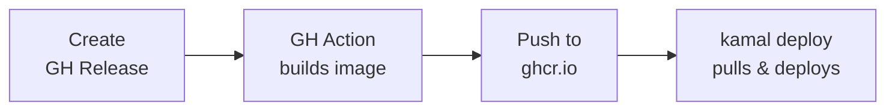

# CI/CD Pipeline

## Container Registry

Sandcastle uses **GitHub Container Registry** (`ghcr.io`) for Docker images.

- **Image:** `ghcr.io/thieso2/sandcastle`
- **Visibility:** Public (free unlimited storage/bandwidth)
- **Auth:** GitHub PAT with `write:packages` scope

## Release Workflow



### How it works

1. Create a GitHub release with a semver tag (e.g., `v1.0.0`)
2. GitHub Actions builds the Docker image and pushes to ghcr.io with tags:
   - `1.0.0` (exact version)
   - `1.0` (minor)
   - `1` (major)
   - `latest`
3. Run `kamal deploy` on the deploy host to pull the pre-built image and deploy

### Hotfixes

For quick hotfixes, `kamal deploy` still builds locally and pushes directly to ghcr.io.

## Setup (one-time, on deploy host)

1. Create a GitHub PAT with `write:packages` scope
2. Add to `.env` on the deploy host:
   ```bash
   GITHUB_TOKEN=ghp_...
   ```
3. Verify login:
   ```bash
   docker login ghcr.io -u thieso2 --password-stdin <<< $GITHUB_TOKEN
   ```
