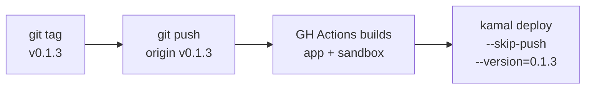

# Deployment

## Registry

- **App image:** `ghcr.io/thieso2/sandcastle`
- **Sandbox image:** `ghcr.io/thieso2/sandcastle-sandbox`
- **Auth:** GitHub PAT with `write:packages` scope, stored as `GITHUB_TOKEN` in `.env`

## Deploy Workflows

### Full Release (CI-built image)



```bash
git tag v0.1.3
git push origin v0.1.3
# wait for CI to finish (check https://github.com/thieso2/Sandcastle/actions)
kamal deploy --skip-push --version=0.1.3
```

CI builds both images in parallel and pushes with semver tags (`0.1.3`, `0.1`, `0`, `latest`).

### Quick Hotfix (local build)

```bash
kamal deploy
```

Builds on your machine and pushes directly to ghcr.io. No tag or CI needed.

## Setup (one-time, on deploy host)

1. Create a GitHub PAT (classic) with `write:packages` scope
2. Add to `.env` on the deploy host and locally:
   ```bash
   GITHUB_TOKEN=ghp_...
   ```
3. Verify login:
   ```bash
   docker login ghcr.io -u thieso2 --password-stdin <<< $GITHUB_TOKEN
   ```
