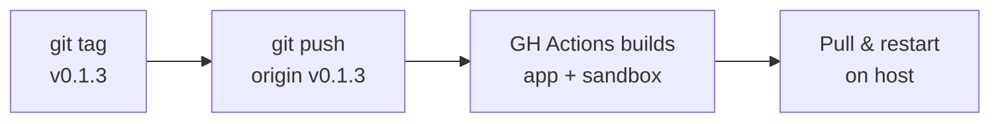

# Deployment

## Registry

- **App image:** `ghcr.io/thieso2/sandcastle`
- **Sandbox image:** `ghcr.io/thieso2/sandcastle-sandbox`
- **Auth:** GitHub PAT with `write:packages` scope, stored as `GITHUB_TOKEN` in `.env`

## Deploy Workflows

### Full Release (CI-built image)



```bash
git tag v0.1.3
git push origin v0.1.3
# wait for CI to finish (check https://github.com/thieso2/Sandcastle/actions)

# On deploy host:
docker compose pull
docker compose up -d --force-recreate
```

CI builds both images in parallel and pushes with semver tags (`0.1.3`, `0.1`, `0`, `latest`).

### Quick Hotfix (local build)

Build and push manually:

```bash
# Build app image
docker build -t ghcr.io/thieso2/sandcastle:latest .
docker push ghcr.io/thieso2/sandcastle:latest

# Build sandbox image
docker build -t ghcr.io/thieso2/sandcastle-sandbox:latest images/sandbox/
docker push ghcr.io/thieso2/sandcastle-sandbox:latest

# On deploy host:
docker compose pull
docker compose up -d --force-recreate
```

## Setup (one-time, on deploy host)

1. Create a GitHub PAT (classic) with `write:packages` scope
2. Add to `.env` on the deploy host and locally:
   ```bash
   GITHUB_TOKEN=ghp_...
   ```
3. Verify login:
   ```bash
   docker login ghcr.io -u thieso2 --password-stdin <<< $GITHUB_TOKEN
   ```

## Deployment Architecture

### Services

All services defined in `docker-compose.yml`:

- **sandcastle-web** - Rails app (Puma)
- **sandcastle-worker** - Solid Queue worker
- **sandcastle-postgres** - PostgreSQL 18 database
- **sandcastle-traefik** - Traefik reverse proxy (HTTPS)

### Networks

- **sandcastle-web** - Internal network for app, worker, postgres, traefik
- User sandboxes connect to this network for WeTTY terminal access

### Volumes

- **sandcastle_sandcastle-data** - App data (`/data`)
- **sandcastle_traefik-data** - Traefik config and Let's Encrypt certs
- **sandcastle_postgres-data** - PostgreSQL data

### Environment Variables

Required in `.env`:
- `SECRET_KEY_BASE` - Rails secret (generate with `bin/rails secret`)
- `RAILS_MASTER_KEY` - Rails credentials key (from `config/master.key`)
- `DB_PASSWORD` - PostgreSQL password
- `GITHUB_CLIENT_ID` - OAuth app client ID
- `GITHUB_CLIENT_SECRET` - OAuth app secret
- `SANDCASTLE_HOST` - Public hostname (e.g., `demo.sandcastle.rocks`)
- `SANDCASTLE_DATA_DIR=/data` - Data directory inside container

## Common Tasks

### View logs
```bash
docker compose logs -f sandcastle-web
docker compose logs -f sandcastle-worker
```

### Restart services
```bash
docker compose restart sandcastle-web
docker compose restart sandcastle-worker
```

### Database console
```bash
docker compose exec sandcastle-postgres psql -U sandcastle -d sandcastle_production
```

### Rails console
```bash
docker compose exec sandcastle-web bin/rails console
```

### Run migrations
```bash
docker compose exec sandcastle-web bin/rails db:migrate
```

## Monitoring

- **Health check:** `https://<host>/up` (returns 200 if healthy)
- **Job dashboard:** `https://<host>/admin/jobs` (Mission Control)
- **Logs:** `docker compose logs -f`

## Rollback

To rollback to a previous version:

```bash
# Update docker-compose.yml image tags to previous version
# or pull specific version
docker pull ghcr.io/thieso2/sandcastle:0.1.2
docker tag ghcr.io/thieso2/sandcastle:0.1.2 ghcr.io/thieso2/sandcastle:latest
docker compose up -d --force-recreate
```
