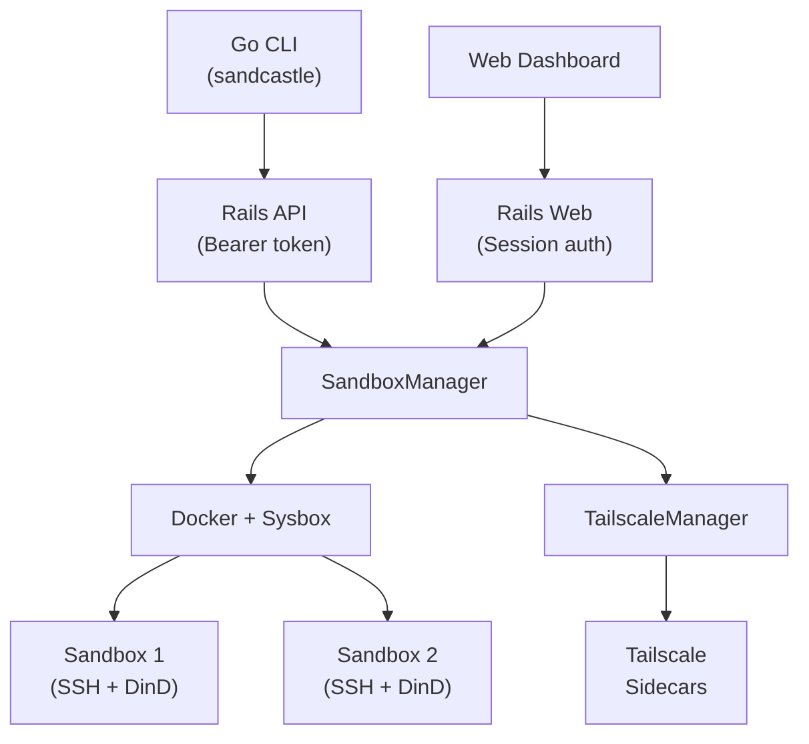

# Sandcastle

Self-hosted shared Docker sandbox platform. Each user gets isolated [Sysbox](https://github.com/nestybox/sysbox) containers with SSH access and a full Docker daemon inside.

## Architecture



- **Backend:** Rails 8.1 (Ruby 4.0), SQLite, Solid Queue/Cache/Cable
- **CLI:** Go + Cobra (`vendor/sandcastle-cli/`)
- **Containers:** Docker + Sysbox (`sysbox-runc`) for sandboxes
- **Auth:** Session-based (web) + API tokens (`sc_` prefix, bcrypt)
- **Sandbox image:** Ubuntu 24.04 with Docker-in-Docker, SSH, dev tools

## Getting Started

### Prerequisites

- Ruby 4.0
- Docker with [Sysbox](https://github.com/nestybox/sysbox) runtime
- Go 1.22+ (for CLI development)

### Development

```bash
bin/dev              # Start dev server (web + Tailwind watcher)
bin/rails test       # Run tests
bin/rubocop          # Lint
bin/brakeman         # Security scan
bin/ci               # Full CI suite
```

### CLI

```bash
cd vendor/sandcastle-cli && make build
sandcastle create my-dev --home --data
sandcastle list
sandcastle ssh my-dev
sandcastle destroy my-dev
```

## Deployment

See [DEPLOY.md](DEPLOY.md) for registry setup, CI/CD pipeline, and deploy workflows.

## License

MIT
