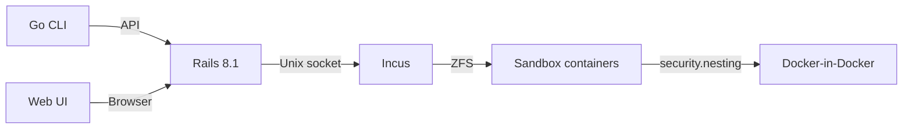

# Sandcastle

Self-hosted shared sandbox platform. Each user gets an isolated [Incus](https://linuxcontainers.org/incus/) system container with SSH access and a full Docker daemon inside.



## Stack

| Layer | Technology |
|-------|-----------|
| Web/API | Rails 8.1, Ruby 4.0, SQLite |
| CLI | Go, Cobra |
| Containers | Incus system containers on ZFS |
| Deploy | Kamal (Rails app in Docker) |
| Proxy | Caddy |

## Quick start

```bash
# 1. Set up the remote server (installs Incus, ZFS, Docker, Caddy, builds images)
bin/setup-server user@your-server

# 2. Deploy the Rails app
kamal deploy

# 3. Prepare the database
kamal app exec 'bin/rails db:prepare'
```

See [INSTALL.md](INSTALL.md) for detailed setup and configuration.

## Development

```bash
bin/dev              # Start dev server (web + Tailwind watcher)
bin/rails test       # Run tests
bin/rubocop          # Lint
bin/ci               # Full CI (rubocop, brakeman, audit, tests)
```

### CLI

```bash
cd vendor/sandcastle-cli
make build           # Build binary → ./sandcastle
```

## How it works

- Each sandbox is an Incus system container with `security.nesting=true`
- SSH access via proxy devices (ports 2201-2299)
- Persistent user homes at `/data/users/{name}/home`
- Snapshots are instant ZFS copy-on-write operations
- Optional per-user Tailscale sidecar for tailnet connectivity

## License

Proprietary.
