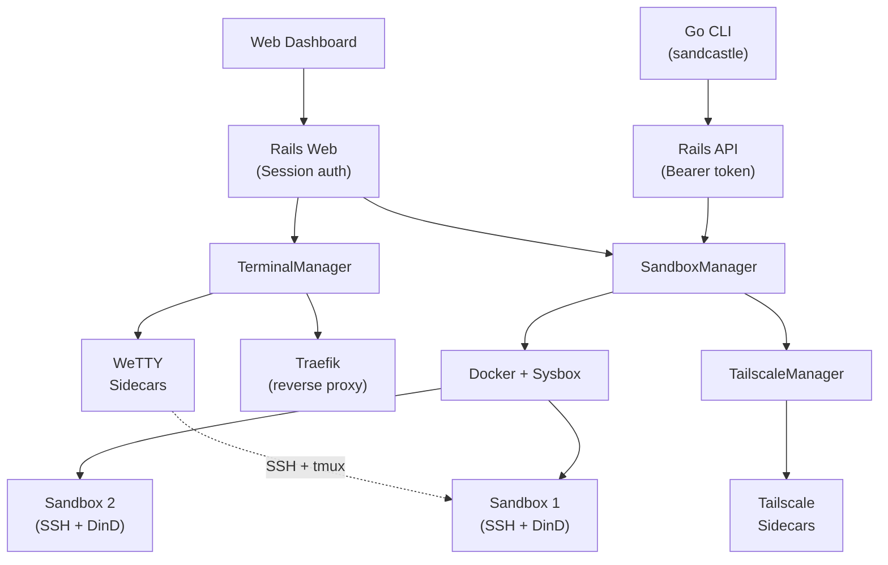

# Sandcastle

Self-hosted shared Docker sandbox platform. Each user gets isolated [Sysbox](https://github.com/nestybox/sysbox) containers with SSH access and a full Docker daemon inside.

## Architecture


```mermaid
flowchart TB
    CLI["Go CLI\n(sandcastle)"] --> API["Rails API\n(Bearer token)"]
    Browser["Web Dashboard"] --> Web["Rails Web\n(Session auth)"]
    API --> SM["SandboxManager"]
    Web --> SM
    Web --> TM["TerminalManager"]
    SM --> Docker["Docker + Sysbox"]
    Docker --> S1["Sandbox 1\n(SSH + DinD)"]
    Docker --> S2["Sandbox 2\n(SSH + DinD)"]
    TM --> Traefik["Traefik\n(reverse proxy)"]
    TM --> WeTTY["WeTTY\nSidecars"]
    WeTTY -.->|SSH + tmux| S1
    SM --> TS["TailscaleManager"]
    TS --> TSC["Tailscale\nSidecars"]
```

- **Backend:** Rails 8.1 (Ruby 4.0), PostgreSQL, Solid Queue/Cache/Cable
- **CLI:** Go + Cobra (`vendor/sandcastle-cli/`)
- **Containers:** Docker + Sysbox (`sysbox-runc`) for sandboxes
- **Web terminal:** [WeTTY](https://github.com/butlerx/wetty) sidecar containers with Traefik routing
- **Auth:** Session-based (web) + API tokens (`sc_` prefix, bcrypt)
- **Sandbox image:** Ubuntu 24.04 with Docker-in-Docker, SSH, dev tools

## Getting Started

### Prerequisites

- Ruby 4.0
- Docker with [Sysbox](https://github.com/nestybox/sysbox) runtime
- Go 1.22+ (for CLI development)

### Development

```bash
bin/dev              # Start dev server (web + Tailwind watcher)
bin/rails test       # Run tests
bin/rubocop          # Lint
bin/brakeman         # Security scan
bin/ci               # Full CI suite
```

### CLI

```bash
cd vendor/sandcastle-cli && make build
sandcastle create my-dev --home --data
sandcastle list
sandcastle ssh my-dev
sandcastle destroy my-dev
```

## Cloud Identity

Sandcastle can inject short-lived GCP credentials into sandboxes using OIDC and Workload Identity Federation. See [GCP OIDC Setup](docs/GCP_OIDC_SETUP.md) for the admin workflow, and [OIDC Federation](docs/OIDC_FEDERATION.md) for the architecture and security model.

## CLI Configuration

The CLI stores its configuration in `~/.sandcastle/config.yaml`. You can set default preferences so you don't have to pass flags on every `sandcastle create`.

### Setting defaults

```bash
sandcastle config set mount_home true      # always mount persistent home (--home)
sandcastle config set data_path .          # always mount data dir (--data)
sandcastle config set vnc false            # disable VNC by default (--no-vnc)
sandcastle config set docker true          # enable Docker (default)
sandcastle config set connect_protocol ssh # "ssh" (default) or "mosh"
sandcastle config set use_tmux true        # wrap sessions in tmux (default: true)
sandcastle config set ssh_extra_args "-o StrictHostKeyChecking=no"
```

### Viewing current config

```bash
sandcastle config show
```

### Example config file

```yaml
# ~/.sandcastle/config.yaml
current_server: default
servers:
  default:
    url: https://sandcastle.example.com
    token: sc_abcd1234_...
preferences:
  mount_home: true
  data_path: "."
  vnc: false
  docker: true
  connect_protocol: ssh
  use_tmux: true
```

### Preference reference

| Key | Default | Description |
|-----|---------|-------------|
| `connect_protocol` | `ssh` | Connection protocol: `ssh` or `mosh` |
| `use_tmux` | `true` | Wrap connection in tmux session |
| `ssh_extra_args` | _(empty)_ | Extra flags appended to ssh/mosh |
| `mount_home` | `false` | Mount persistent home directory on create |
| `data_path` | _(empty)_ | Mount user data dir on create (`.` for root, or a subpath) |
| `vnc` | `true` | Enable VNC display server on create |
| `docker` | `true` | Enable Docker daemon (DinD) on create |

### Override priority

Explicit flags > environment variables > config file > built-in defaults.

Environment variables: `SANDCASTLE_CONNECT_PROTOCOL`, `SANDCASTLE_USE_TMUX`, `SANDCASTLE_SSH_EXTRA_ARGS`, `SANDCASTLE_HOME`, `SANDCASTLE_DATA`, `SANDCASTLE_VNC`, `SANDCASTLE_DOCKER`.

## Deployment

See [DEPLOY.md](DEPLOY.md) for registry setup, CI/CD pipeline, and deploy workflows.

## Acknowledgments

- [WeTTY](https://github.com/butlerx/wetty) by Cian Butler and contributors — the browser-based terminal emulator powering Sandcastle's web terminal feature
- [Sysbox](https://github.com/nestybox/sysbox) by Nestybox — the container runtime enabling secure Docker-in-Docker sandboxes
- [Traefik](https://github.com/traefik/traefik) — reverse proxy handling TLS termination and dynamic routing

## License

MIT
