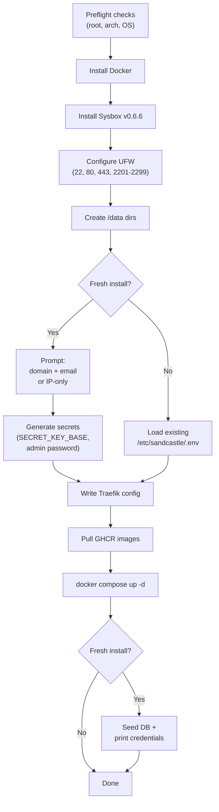

# Sandcastle Installer

One-command installer for fresh Ubuntu 24.04 VMs.

```bash
curl -fsSL https://install.sandcastle.rocks | sudo bash
```

## What It Does



## Two TLS Modes

### Domain Mode (Let's Encrypt)

When you enter a domain name, the installer configures Traefik with automatic Let's Encrypt certificates.

```
Domain name: sandcastle.example.com
Email for Let's Encrypt: admin@example.com
```

### IP-Only Mode (Self-Signed)

Leave the domain empty to use IP-only mode. The installer auto-detects your public IP and generates a self-signed certificate.

```
Domain name: (leave empty)
Server IP [203.0.113.42]: (press enter)
```

## File Layout

```
/etc/sandcastle/
├── .env                    # Secrets + settings (chmod 600)
└── docker-compose.yml      # Production compose

/data/
├── users/                  # User home mounts
├── sandboxes/              # Sandbox volume mounts
└── traefik/
    ├── traefik.yml         # Static config
    ├── acme.json           # Let's Encrypt certs
    ├── certs/              # Self-signed certs (IP mode)
    │   ├── cert.pem
    │   └── key.pem
    └── dynamic/            # Route configs
        └── rails.yml
```

## Upgrades

Re-run the installer to upgrade. It detects the existing `/etc/sandcastle/.env` and:

- Preserves all secrets and settings
- Pulls the latest images from ghcr.io
- Restarts containers with `docker compose up -d`
- Skips DB seeding (only runs on fresh install)

## Post-Install

```bash
# View logs
docker compose -f /etc/sandcastle/docker-compose.yml logs -f

# Restart
docker compose -f /etc/sandcastle/docker-compose.yml restart

# Stop
docker compose -f /etc/sandcastle/docker-compose.yml down

# View config
cat /etc/sandcastle/.env
```

## Requirements

- Ubuntu 24.04 (other Debian-based distros may work)
- amd64 architecture
- Root access
- Ports 80, 443, 2201-2299 available
