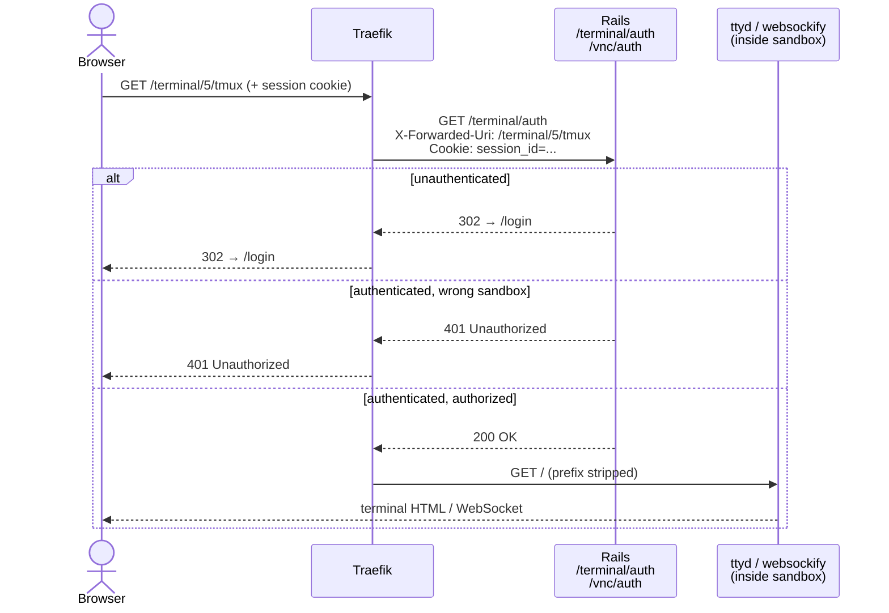

# VNC and ttyd Authentication

Both the browser-based terminal (ttyd) and the VNC browser session are protected
by Traefik's `forwardAuth` middleware backed by Rails. Neither service is
exposed directly to the internet.

## Architecture



## Traefik Config (per sandbox)

Each time a terminal or VNC session is opened, Rails writes a dynamic Traefik
config file (`/data/traefik/dynamic/terminal-{id}.yml` or `vnc-{id}.yml`).

### Terminal (`terminal-{id}.yml`)

```yaml
http:
  routers:
    terminal-5-tmux:
      rule: Host(`example.com`) && PathPrefix(`/terminal/5/tmux`)
      middlewares: [terminal-auth-5, terminal-5-strip-tmux]
      service: terminal-5-tmux
      priority: 100
    terminal-5-shell:
      rule: Host(`example.com`) && PathPrefix(`/terminal/5/shell`)
      middlewares: [terminal-auth-5, terminal-5-strip-shell]
      service: terminal-5-shell
      priority: 100

  middlewares:
    terminal-auth-5:
      forwardAuth:
        address: http://sandcastle-web:80/terminal/auth
        trustForwardHeader: true
    terminal-5-strip-tmux:
      stripPrefix:
        prefixes: [/terminal/5/tmux]
    terminal-5-strip-shell:
      stripPrefix:
        prefixes: [/terminal/5/shell]

  services:
    terminal-5-tmux:
      loadBalancer:
        servers: [{url: "http://thies-mybox:7681"}]   # ttyd tmux port
    terminal-5-shell:
      loadBalancer:
        servers: [{url: "http://thies-mybox:7682"}]   # ttyd shell port
```

### VNC (`vnc-{id}.yml`)

Same pattern: `forwardAuth` + `stripPrefix(/vnc/{id})` → websockify on port 6080.

## Rails auth endpoints

### `GET /terminal/auth` (`TerminalController#auth`)

```
allow_unauthenticated_access  ← Traefik must be able to reach this without a session
```

1. Parse `X-Forwarded-Uri` — must match `/terminal/{id}/(tmux|shell)`, else **401**
2. Find session from cookie — if missing, **302 → /login** (return URL preserved)
3. Look up `Sandbox.active.find_by(id:)` — if not found, **401**
4. Check `sandbox.user_id == user.id || user.admin?` — if not, **401**
5. **200 OK** → Traefik forwards request to ttyd

### `GET /vnc/auth` (`VncController#auth`)

Identical flow; `X-Forwarded-Uri` matched against `/vnc/{id}`.

## ttyd ports (inside sandbox)

| Port | Command | Clients |
|------|---------|---------|
| 7681 | `tmux new-session -A -s main` | unlimited (`-m 0`) — all tabs share one session |
| 7682 | `bash -l` | one at a time (`-m 1`) |

Both processes start at container boot via `entrypoint.sh`, running as the sandbox user.

## Security properties

- **No direct exposure** — ttyd and websockify bind only inside the sandbox container,
  which is on the `sandcastle-web` Docker network. They are never port-mapped to the host.
- **Sandbox isolation** — the sandbox ID in the URL is verified against the authenticated
  user's sandbox list. A user cannot access another user's terminal or VNC session.
- **Admin access** — admins can access any sandbox's terminal or VNC.
- **Unauthenticated redirect** — Traefik passes the 302 redirect through to the browser,
  so users land on the login page and return to their terminal after authenticating.
- **WebSocket sessions** — forwardAuth is checked on the initial HTTP upgrade request.
  An already-open WebSocket connection persists even if the session is subsequently
  revoked; it closes naturally when the connection is dropped.
- **Traefik config lifecycle** — config files are written on `open` and deleted on `close`
  (or by the `cleanup_orphaned` job when the sandbox is no longer running). A missing
  config means Traefik has no route for that path and the request falls through to Rails,
  which returns 404.
