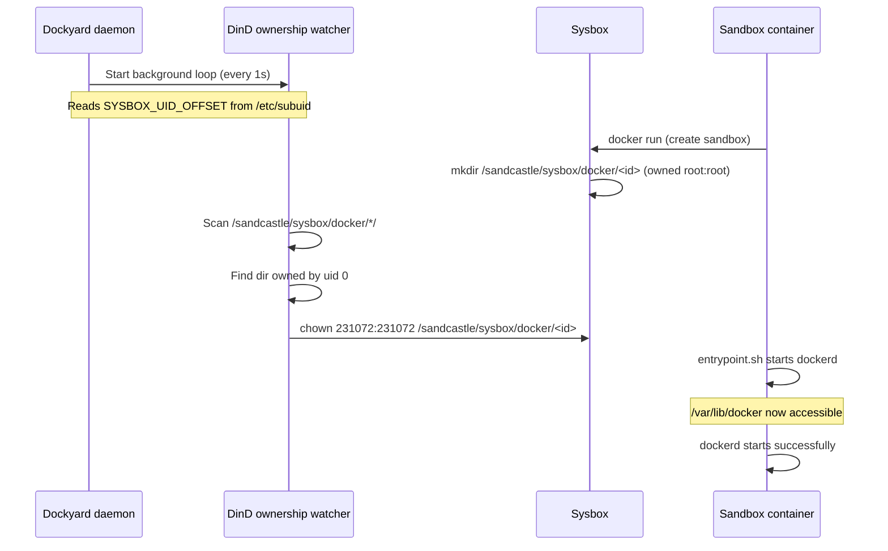

# Docker-in-Docker (DinD) Troubleshooting with Sysbox

## Background

Each Sandcastle sandbox runs inside a **Sysbox** container (`sysbox-runc` runtime). Sysbox makes Docker-in-Docker safe by virtualising the kernel interface, allowing an inner Docker daemon (`dockerd`) to run inside the container without privileged mode.

However, starting with **Docker Engine 29.x**, a subtle ownership bug in how Sysbox creates backing directories breaks DinD on every fresh container. This document explains the root cause, how to diagnose it, and how the permanent fix works.

---

## Architecture: How Sysbox DinD Storage Works

```
Host filesystem
└── /sandcastle/sysbox/docker/
    └── <container-id>/          ← Sysbox creates this dir (owned root:root)
        └── ...                   ← inner /var/lib/docker contents

Inside sandbox container
└── /var/lib/docker               ← Sysbox bind-mounts the backing dir here
    └── overlay2/ ...             ← Docker writes container layers here
```

Sysbox uses **user namespace isolation**: container UID 0 (root) maps to a non-privileged host UID (the "UID offset", typically 231072). This is what makes running Docker inside a container safe — the container thinks it's root, but the host sees it as an unprivileged user.

---

## Root Cause: The Ownership Bug

### What Sysbox Does (Incorrectly)

When a sandbox container starts, Sysbox creates the backing directory:

```
/sandcastle/sysbox/docker/<container-id>/
```

It creates this directory owned by **`root:root` (host UID 0)**.

### What This Means Inside the Container

Because container UID 0 → host UID 231072, the container sees this directory as owned by `nobody:nogroup` (UID 65534 or similar). Container root **cannot access** a directory owned by a different host user.

### Why Docker 29 Made It Fatal

Prior to Docker 29, `dockerd` would attempt `chmod /var/lib/docker` at startup and silently tolerate a permission denied error. Docker 29.2.1 hardened this check and made the `chmod` **fatal**:

```
Error starting daemon: error initializing graphdriver: error creating overlay mounts
to start container: operation not permitted
```

The daemon exits immediately. Every new sandbox starts with a broken Docker daemon.

---

## Diagnosis

### Symptoms

1. `docker ps` inside a sandbox fails:
   ```
   Cannot connect to the Docker daemon at unix:///var/run/docker.sock. Is the docker daemon running?
   ```
2. SSH login shows:
   ```
   DinD: FAILED — run 'docker-restart' or check /var/log/dockerd.log
   ```
3. `/var/log/dockerd.log` contains:
   ```
   Error starting daemon: error initializing graphdriver: ... operation not permitted
   ```

### Confirming the Root Cause

On the **host** (sandman), find the container ID and check the backing dir:

```bash
# Find backing dir for a specific container
CONTAINER_ID=$(docker ps --filter name=sc-<sandbox-name> --format '{{.ID}}')
ls -la /sandcastle/sysbox/docker/$CONTAINER_ID
```

If it shows `root root`, the bug is confirmed:

```
drwx------ 7 root root 4096 Jan 15 12:34 /sandcastle/sysbox/docker/abc123def456
```

### Quick Manual Fix (for a running container)

```bash
# On the host (sandman):
CONTAINER_ID=$(docker ps --filter name=sc-<sandbox-name> --format '{{.ID}}')
sudo chown 231072:231072 /sandcastle/sysbox/docker/$CONTAINER_ID

# Then inside the sandbox:
docker-restart
```

---

## The Permanent Fix

The fix lives in `installer/templates/dockyard.sh` (injected into `installer.sh` at build time). A **background watcher** runs inside the Dockyard daemon process and watches for new backing directories created by Sysbox, chowning them to the correct UID within ~1 second of container creation.

### How the Watcher Works



### Key Implementation Details

**Reading the actual UID offset** (not hardcoding 231072):

```bash
SYSBOX_UID_OFFSET=$(awk -F: '$1=="sysbox" {print $2; exit}' /etc/subuid 2>/dev/null || echo 231072)
```

`/etc/subuid` contains:
```
sysbox:231072:65536
```

This reads the correct offset even if the system assigns a different range.

**Fixing leftover dirs** (e.g. from before the fix was deployed):

```bash
find "$SYSBOX_DOCKER_DIR" -maxdepth 1 -mindepth 1 -uid 0 \
    -exec chown "${SYSBOX_UID_OFFSET}:${SYSBOX_UID_OFFSET}" {} \; 2>/dev/null || true
```

This runs once at Dockyard startup and catches any dirs from containers that were created before the watcher existed.

**Background watcher loop:**

```bash
(
    while true; do
        for d in "${SYSBOX_DOCKER_DIR}"/*/; do
            [ -d "$d" ] || continue
            uid=$(stat -c '%u' "$d" 2>/dev/null) || continue
            [ "$uid" = "0" ] && \
                chown "${SYSBOX_UID_OFFSET}:${SYSBOX_UID_OFFSET}" "$d" 2>/dev/null
        done
        sleep 1
    done
) &
```

The loop runs every 1 second. CPU overhead is negligible (a single `stat` call per existing container per second).

### Self-Healing in entrypoint.sh

The sandbox `entrypoint.sh` also has a two-attempt startup to handle the race condition where the watcher hasn't yet run when the container first boots:

```
Container starts
    └── Attempt 1: start dockerd → wait 15s
          ├── Success: write "ready" → done
          └── Failure: wait 5s more (watcher runs), retry
                ├── Success: write "ready (recovered)" → done
                └── Failure: write "FAILED — run docker-restart" → done
```

The 5-second wait gives the host watcher time to chown the backing dir. After the watcher runs, the second attempt succeeds.

---

## The `docker-restart` Command

A `docker-restart` command is installed in every sandbox at `/usr/local/bin/docker-restart`. Use it when DinD is broken:

```bash
# Basic restart (stop, restart dockerd)
docker-restart

# Full reset (also wipes all inner images and containers)
docker-restart --reset
```

`--reset` uses `find /var/lib/docker -mindepth 1 -delete` (not `rm -rf /var/lib/docker`) because `/var/lib/docker` is a Sysbox BTRFS bind-mount point — the directory itself cannot be removed, only its contents.

---

## Technical Notes

### Why Not Use `--data-root` to Avoid the Problem?

Attempts to use `--data-root=/var/lib/docker-data` (on the container's overlay layer) failed:

```
failed to mount overlay: invalid argument
```

overlay2 on top of overlay (the container's root filesystem) is not supported even with Sysbox. The inner Docker daemon **must** use the BTRFS-backed `/var/lib/docker` mount that Sysbox provides.

### Why Not Fix It in entrypoint.sh Alone?

The container cannot chown its own `/var/lib/docker` backing directory — from inside the container it's already owned by the container's root. The host-level backing path (`/sandcastle/sysbox/docker/<id>`) is invisible from inside the container. Only a process running on the **host** can fix the ownership.

### Sysbox Version

This behavior was observed with **Sysbox 0.6.7** on **kernel 6.17**. The backing dir ownership issue may be a Sysbox bug that gets fixed in a future release, at which point the watcher becomes a harmless no-op.

---

## Files Involved

| File | Role |
|------|------|
| `installer/templates/dockyard.sh` | Source of truth for the watcher (edit this, not `installer.sh`) |
| `installer.sh` | Generated from template — contains the watcher at startup |
| `images/sandbox/entrypoint.sh` | Two-attempt dockerd startup with 5s recovery wait |
| `images/sandbox/docker-restart.sh` | Manual recovery tool for sandbox users |
| `images/sandbox/Dockerfile` | Installs `docker-restart` into the image |
