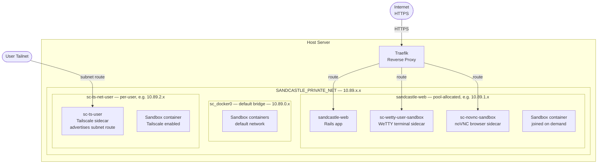

# Sandcastle Networking

Sandcastle runs an **isolated Docker daemon** ("dockyard") separate from the host's system Docker. All container networking — sandboxes, terminals, VNC, Tailscale — runs through this daemon and is confined to RFC 1918 private IP ranges that you control.

## Configuration variables

Set these in `sandcastle.env` before running `installer.sh install`.

### `SANDCASTLE_PRIVATE_NET` (default: `10.89.0.0/16`)

The **single knob** for all Sandcastle networking. Every Docker network is carved from this /16. Change it if the default conflicts with your LAN or existing Docker setup.

Must be an RFC 1918 private range:

| Range | Example value |
|---|---|
| Class A | `10.89.0.0/16` (default) |
| Class B | `172.20.0.0/16` |
| Class C | `192.168.89.0/16`* |

> \* 192.168.x.x is a /16 in the RFC but many networks are already in use there — prefer 10.x.x.x or 172.16–31.x.x.

The installer automatically derives `DOCKYARD_BRIDGE_CIDR`, `DOCKYARD_FIXED_CIDR`, and `DOCKYARD_POOL_BASE` from this value. You only need the individual overrides below if you need fine-grained control.

---

### Derived variables (override only if needed)

#### `DOCKYARD_BRIDGE_CIDR` (derived: `<net>.0.1/24`)

The **gateway IP and mask** for dockyard's default bridge interface (`sc_docker0` on the host). This is what Docker calls `bip`. Every container on the default bridge reaches the host via this IP.

Example for `10.89.0.0/16`: `10.89.0.1/24`

#### `DOCKYARD_FIXED_CIDR` (derived: `<net>.0.0/24`)

The **container address range** on the default bridge. Limits IPs Docker assigns to containers here, keeping them predictable and distinct from subnets allocated to user-defined networks.

Example for `10.89.0.0/16`: `10.89.0.0/24`

#### `DOCKYARD_POOL_BASE` (derived: same as `SANDCASTLE_PRIVATE_NET`)

The **address pool** from which dockyard allocates subnets for every user-defined Docker network (`sandcastle-web`, `sc-ts-net-*`, etc.). When a network is created without an explicit subnet, Docker carves a free `/24` from this range.

#### `DOCKYARD_POOL_SIZE` (default: `24`)

The prefix length of each subnet allocated from the pool. `/24` gives 254 usable container IPs per network and allows up to 256 networks within a `/16` pool.

---

## Runtime networks

These Docker networks are created automatically — no configuration needed.

### `sandcastle-web`

Created once by the installer. Subnet auto-allocated from `DOCKYARD_POOL_BASE` (first available /24).

The internal "service bus" — anything that needs to talk to anything else goes through here:

| Container | Purpose |
|---|---|
| `sandcastle-web` | Rails app |
| `sc-wetty-{user}-{sandbox}` | Web terminal sidecars (SSH into sandbox) |
| `sc-novnc-{sandbox}` | noVNC browser UI containers |
| sandbox containers | Joined on demand when a terminal or VNC session opens |

Traefik routes external HTTPS traffic into this network.

### `sc-ts-net-{username}`

Created by `TailscaleManager` when a user enables Tailscale. One network per user, each with an **explicitly assigned /24** derived from `DOCKYARD_POOL_BASE`:

```
base = DOCKYARD_POOL_BASE   # e.g. 10.89.0.0/16
subnet = oct1.oct2.(1 + user_id % 255).0/24

# user_id=1  → 10.89.2.0/24
# user_id=2  → 10.89.3.0/24
```

| Container | Purpose |
|---|---|
| `sc-ts-{username}` | Tailscale sidecar — joins user's tailnet, advertises the /24 as a subnet route |
| sandbox containers | Joined when `tailscale_auto_connect` is enabled |

Because these subnets sit within `DOCKYARD_POOL_BASE`, dockyard's iptables NAT rules cover them automatically — sandbox containers get outbound internet.

---

## Network layout (default)



---

## How to configure during install

### Quickstart (change the private range)

```bash
# 1. Generate config
sudo installer.sh gen-env

# 2. Change the private network
sed -i 's|SANDCASTLE_PRIVATE_NET=.*|SANDCASTLE_PRIVATE_NET=172.20.0.0/16|' sandcastle.env

# 3. Install
sudo installer.sh install
```

Or edit `sandcastle.env` manually — the relevant section looks like:

```bash
# ─── Dockyard (Docker + Sysbox) ──────────────────────────────────────────────

DOCKYARD_ROOT=/sandcastle
DOCKYARD_DOCKER_PREFIX=sc_

# Private /16 from which all Sandcastle Docker networks are carved.
# Must be RFC 1918: 10.x.x.x, 172.16-31.x.x, or 192.168.x.x.
SANDCASTLE_PRIVATE_NET=10.89.0.0/16
#DOCKYARD_BRIDGE_CIDR=10.89.0.1/24   # uncomment to override
#DOCKYARD_FIXED_CIDR=10.89.0.0/24    # uncomment to override
#DOCKYARD_POOL_BASE=10.89.0.0/16     # uncomment to override
DOCKYARD_POOL_SIZE=24
```

### Fine-grained override example

If you want the bridge on one range and the pool on another (e.g. bridge on `10.42.x.x`, pool on `10.89.x.x`):

```bash
SANDCASTLE_PRIVATE_NET=10.89.0.0/16    # pool stays here
DOCKYARD_BRIDGE_CIDR=10.42.0.1/24     # override bridge to a different range
DOCKYARD_FIXED_CIDR=10.42.0.0/24
```

### Changing the network on an existing install

> **Warning:** changing these values after install requires destroying and recreating dockyard (the isolated Docker daemon) because Docker bakes the address pool into its state. This will also recreate the `sandcastle-web` network, briefly interrupting running sandboxes.

```bash
# Update sandcastle.env with the new SANDCASTLE_PRIVATE_NET value, then:
sudo installer.sh reset
```
