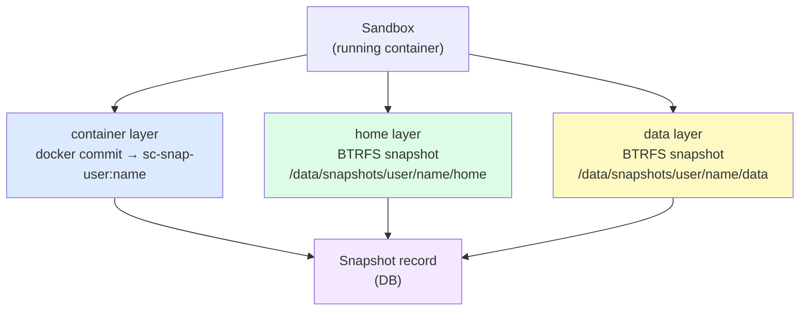
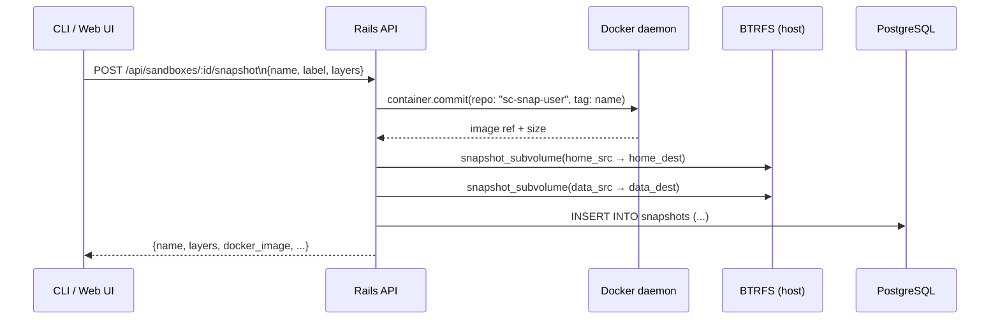
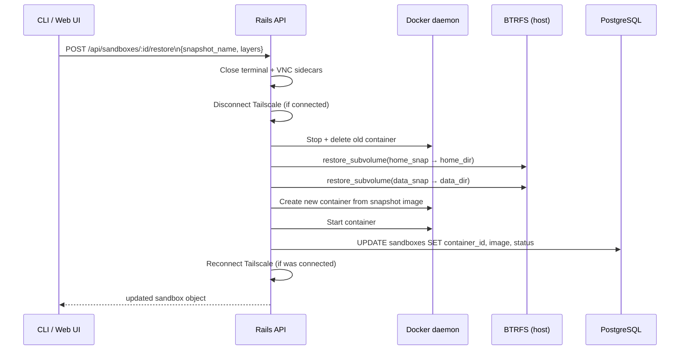
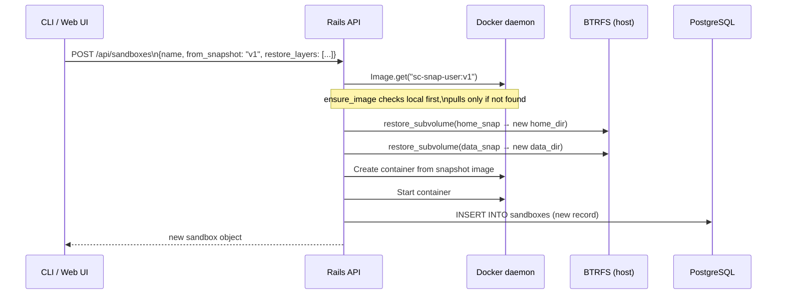
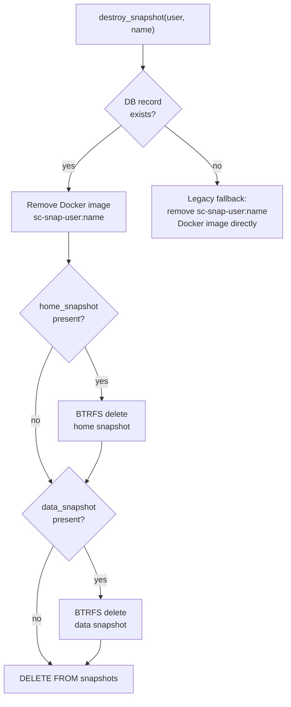
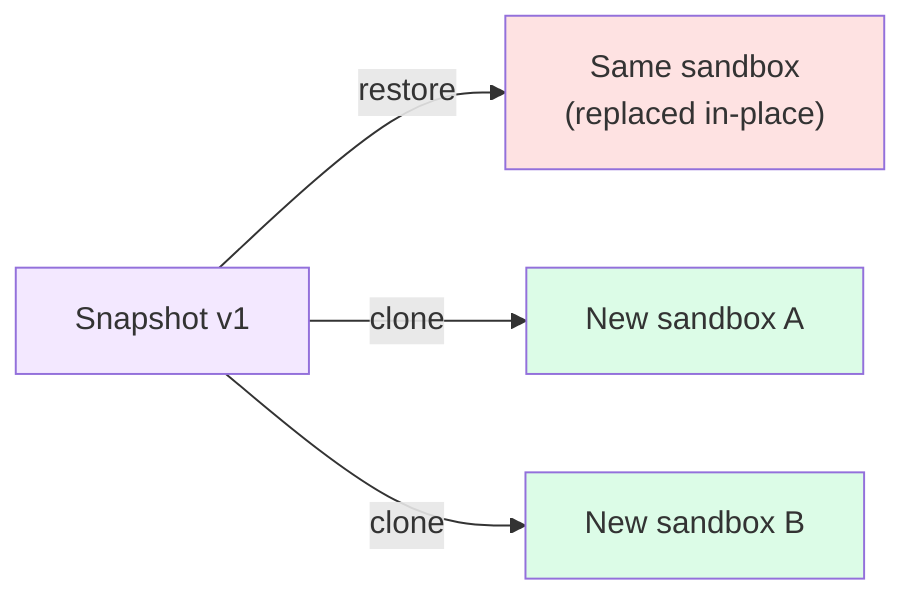

# Sandcastle Snapshots

Snapshots capture the state of a sandbox at a point in time. They are used for backup, rollback, branching workflows, and distributing pre-configured environments.

## Contents

- [Concepts](#concepts)
- [Layers](#layers)
- [Storage Layout](#storage-layout)
- [Lifecycle](#lifecycle)
- [CLI Reference](#cli-reference)
- [Creating a New Sandbox from a Snapshot](#creating-a-new-sandbox-from-a-snapshot)
- [Restore vs Clone](#restore-vs-clone)
- [Legacy Snapshots](#legacy-snapshots)
- [Internals](#internals)

---

## Concepts

A **snapshot** is a named, user-scoped record that captures one or more *layers* of a sandbox:

| Layer | What it captures | Technology | Requires |
|---|---|---|---|
| `container` | Everything installed inside the sandbox (OS, packages, files in `/`) | `docker commit` | Always available |
| `home` | The user's home directory (`/home/<user>`) | BTRFS subvolume snapshot | BTRFS filesystem + `mount_home` sandbox option |
| `data` | The shared data mount (`/workspace/data`) | BTRFS subvolume snapshot | BTRFS filesystem + `data_path` sandbox option |
| `workspace` | The persistent volume (`/workspace`) | BTRFS subvolume snapshot | BTRFS filesystem + `persistent` sandbox option |

Every snapshot has at least a `container` layer. BTRFS layers are added automatically when the filesystem supports it and the sandbox has those mounts configured.



---

## Layers

### Container layer

Captured via `docker commit`, which freezes the container's writable filesystem layer into a new Docker image. The image is tagged as:

```
sc-snap-<username>:<snapshot-name>
```

This image is stored in the local Docker daemon (not pushed to any registry). It captures everything installed in `/` — packages, configuration, compiled binaries, files written as root — but does **not** capture:

- The user's home directory if it is bind-mounted from the host (`mount_home`)
- Any bind-mounted data paths

### Home layer (BTRFS only)

When the sandbox uses `mount_home: true`, the user's home directory at `/data/users/<username>/home` is a BTRFS subvolume. The snapshot creates a read-write BTRFS snapshot at:

```
/data/snapshots/<username>/<snapshot-name>/home
```

BTRFS snapshots are copy-on-write: they are instant and initially share all disk blocks with the source subvolume.

### Data layer (BTRFS only)

When the sandbox has a `data_path` configured, the data directory at `/data/users/<username>/data/<data_path>` is snapshotted to:

```
/data/snapshots/<username>/<snapshot-name>/data
```

The `--data-subdir` flag allows snapshotting only a subdirectory of the data mount, which is useful for large data volumes where only part needs to be captured.

### Workspace layer (BTRFS only)

When the sandbox has a persistent volume (`persistent: true`), the workspace at `/data/sandboxes/<sandbox>/vol` is snapshotted to:

```
/data/snapshots/<username>/<snapshot-name>/workspace
```

This is stored in the `data_snapshot` database column (shared with the data layer — only one data-side path is stored per snapshot).

---

## Storage Layout

```
/data/
├── snapshots/
│   └── <username>/
│       └── <snapshot-name>/
│           ├── home/          ← BTRFS snapshot of home subvolume
│           └── data/          ← BTRFS snapshot of data/workspace subvolume
│
└── (Docker daemon stores container layer images internally)
     sc-snap-<username>:<snapshot-name>
```

The `snapshots` database table holds metadata for all layers:

| Column | Description |
|---|---|
| `name` | Snapshot name (unique per user) |
| `label` | Optional human-readable description |
| `source_sandbox` | Name of the sandbox this was taken from |
| `docker_image` | Docker image ref (`sc-snap-user:name`) |
| `docker_size` | Size of the Docker image in bytes |
| `home_snapshot` | Absolute path to BTRFS home snapshot (if present) |
| `home_size` | Size of home snapshot in bytes |
| `data_snapshot` | Absolute path to BTRFS data/workspace snapshot (if present) |
| `data_size` | Size of data snapshot in bytes |
| `data_subdir` | Subdir of data mount that was snapshotted (optional) |

---

## Lifecycle

### Create



All three steps (Docker commit, BTRFS home, BTRFS data) are attempted. If BTRFS is not available or the sandbox does not have those mounts, only the container layer is captured.

---

### Restore (in-place)

Restores an existing sandbox back to a snapshot's state. The sandbox is **replaced** in-place: same ID, same SSH port, same config — new container.



> **Warning:** Restore is destructive. Any changes made to the sandbox since the snapshot was taken are permanently lost.

---

### Clone (new sandbox from snapshot)

Creates a **new sandbox** pre-loaded with a snapshot's state. The original sandbox is untouched.



---

### Destroy



---

## CLI Reference

### Create a snapshot

```bash
# Container layer only (default for legacy endpoint)
sandcastle snapshot create my-sandbox v1

# All available layers with a label
sandcastle snapshot create my-sandbox v1 --label "after ruby setup"

# Specific layers only
sandcastle snapshot create my-sandbox v1 --layers container,home

# Snapshot only a subdirectory of the data mount
sandcastle snapshot create my-sandbox v1 --data-subdir projects
```

### List snapshots

```bash
sandcastle snapshot list
# or
sandcastle snapshot ls
```

Output:
```
NAME    SOURCE          LAYERS              SIZE        CREATED
v1      my-sandbox      container home      1.2 GB      2026-02-20 19:00
nightly quantum-phoenix  container           3.4 GB      2026-02-19 13:37
```

### Show snapshot details

```bash
sandcastle snapshot show v1
```

```
Snapshot:       v1
Label:          after ruby setup
Source sandbox: my-sandbox
Created:        2026-02-20 19:00:19

Layers:
  container    sc-snap-thies:v1                                    1.2 GB
  home         (BTRFS snapshot)                                    45.0 MB

Total:         1.2 GB
```

### Restore a sandbox to a snapshot

```bash
# Restore all layers
sandcastle snapshot restore my-sandbox v1

# Restore only the container layer (keep current home/data)
sandcastle snapshot restore my-sandbox v1 --layers container
```

### Create a new sandbox from a snapshot

```bash
# Clone with all layers
sandcastle sandbox create my-sandbox-clone --from-snapshot v1

# Clone container layer only
sandcastle sandbox create my-sandbox-clone --from-snapshot v1 --restore-layers container
```

### Delete a snapshot

```bash
sandcastle snapshot destroy v1
# or
sandcastle snapshot delete v1
```

---

## Restore vs Clone

| | Restore | Clone |
|---|---|---|
| Target | Existing sandbox | New sandbox |
| Original sandbox | Replaced | Untouched |
| ID / SSH port | Preserved | New |
| Use case | Rollback | Branching, environment distribution |
| CLI | `snapshot restore <sandbox> <snap>` | `sandbox create --from-snapshot <snap>` |
| API | `POST /api/sandboxes/:id/restore` | `POST /api/sandboxes` with `from_snapshot` |



---

## Legacy Snapshots

Before the `snapshots` table was introduced, snapshots were stored only as Docker images tagged `sc-snap-<user>:<name>`. These are imported automatically into the database the first time they are accessed (via `import_legacy_snapshots`). The import is idempotent — it only creates new DB records for images that have no existing record.

Legacy snapshots have only a `container` layer; they have no `home_snapshot` or `data_snapshot`.

---

## Internals

### `SandboxManager#create_snapshot`

The primary API. Accepts `layers:` to selectively capture a subset. When `layers:` is `nil`, defaults to all four (`container`, `home`, `data`, `workspace`) and skips silently for any that are not applicable.

### `SandboxManager#snapshot` (legacy alias)

Wraps `create_snapshot` with `layers: %w[container]` only. Used by the original CLI snapshot endpoint and kept for backward compatibility.

### `ensure_image`

Before starting a sandbox from a snapshot image, `ensure_image` checks `Docker::Image.get` first. Only if the image is not found locally does it attempt a remote pull. This is critical because snapshot images are local (`sc-snap-*`) and are never pushed to a registry — attempting to pull them would always fail.

### BTRFS copy-on-write semantics

BTRFS snapshots are instant and space-efficient. At the moment of creation, the snapshot shares all disk blocks with the source subvolume. Only blocks written after the snapshot diverge. This means:

- Creating a snapshot of a 10 GB home directory is near-instantaneous
- The snapshot initially consumes ~0 additional disk space
- Disk usage grows only as the live subvolume or the snapshot diverge

`BtrfsHelper.subvolume_size` reports the exclusive bytes used by the snapshot (blocks not shared with any other subvolume).
