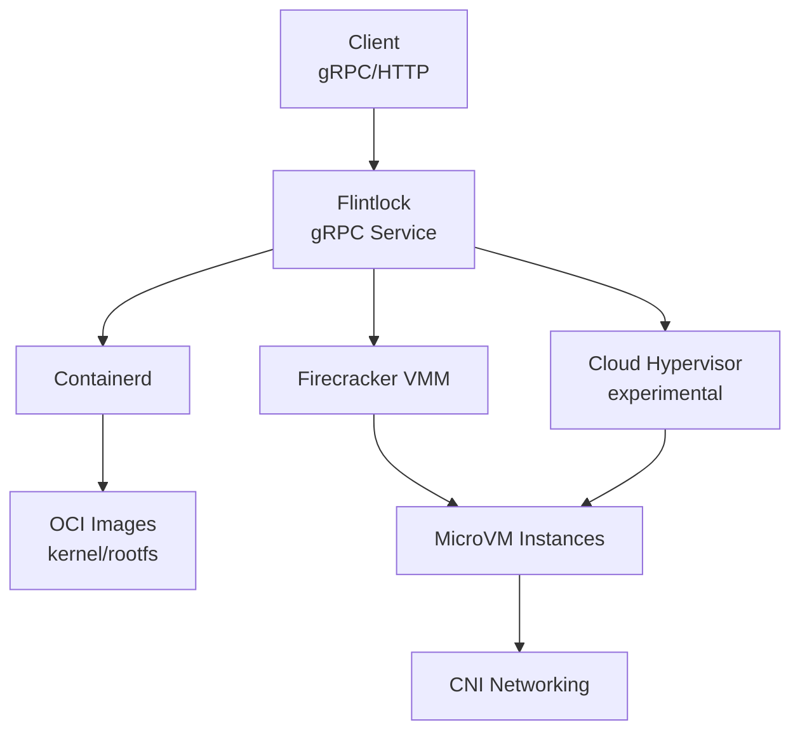

# Flintlock Research Report

## Executive Summary

**Recommendation: NOT SUITABLE for Sandcastle**

Flintlock is a gRPC service that manages Firecracker/Cloud Hypervisor microVMs via containerd integration. While it provides a higher-level abstraction than raw Firecracker, it is **not appropriate for the Sandcastle use case** due to:

1. **Kubernetes-centric design** - Built specifically for Liquid Metal's Kubernetes node provisioning
2. **No nested virtualization support** - Firecracker cannot run in Docker containers without complex workarounds
3. **Limited Docker-in-Docker support** - Not designed for DinD workloads
4. **Community maintenance uncertainty** - Project transitioned from Weaveworks to community ownership with unclear long-term viability
5. **Over-engineered for simple use case** - Adds containerd + gRPC complexity when direct Docker API suffices

Sandcastle's current **Docker + Sysbox** architecture is significantly simpler and better suited for the shared sandbox use case.

---

## What is Flintlock?

### Core Identity

Flintlock is a gRPC service written in Go that manages the lifecycle of lightweight virtual machines (microVMs) on physical and virtual hosts. Its tagline is *"Lock, Stock, and Two Smoking MicroVMs. Create and manage the lifecycle of MicroVMs backed by containerd."*

### Relationship to Firecracker

Flintlock is **not a replacement for Firecracker** but rather a **management layer on top of it**:

- **Firecracker**: A Virtual Machine Monitor (VMM) using Linux KVM to create microVMs
- **Flintlock**: A service that wraps Firecracker (and experimentally Cloud Hypervisor) to provide:
  - Lifecycle management (create/start/stop/pause/delete)
  - OCI image integration via containerd
  - Cloud-init/Ignition metadata configuration
  - Network configuration via CNI
  - gRPC/HTTP API for orchestration

**Analogy**: Firecracker is like `docker run`, while Flintlock is like `dockerd` + a REST API.

### Primary Use Case

Flintlock was created by Weaveworks for the **Liquid Metal** project, which provisions Kubernetes clusters on bare-metal hosts using microVMs as nodes. Key design goals:

- **Dynamic cluster provisioning** on lightweight VMs
- **Resource optimization** through high microVM density
- **Hardware acceleration** support for specialized workloads (5G networks)
- **Edge computing** environments

---

## Architecture

### Components



### Key Architectural Decisions

1. **Containerd Integration**
   - Uses containerd to pull and snapshot OS/kernel images
   - Relies on containerd's devicemapper snapshotter for filesystem devices
   - Stores microVM metadata in containerd

2. **OCI Images Everywhere**
   - Kernel binaries supplied via OCI images (e.g., `docker.io/user/ubuntu-kernel:0.0.11`)
   - Initrd supplied via OCI images
   - Root volumes supplied via OCI images
   - **No large filesystem images** - everything is pulled from registries

3. **Hypervisor Abstraction**
   - Default: Firecracker
   - Experimental: Cloud Hypervisor
   - CLI flag: `--default-provider` to choose VMM

4. **Network Model**
   - MicroVMs tap into parent host interface
   - DHCP assignment from router/VLAN
   - CNI configuration (coming soon)

---

## API Design

### gRPC Service

Flintlock exposes a gRPC API (also accessible via HTTP) with methods like:

- `CreateMicroVM`
- `DeleteMicroVM`
- `GetMicroVM`
- `ListMicroVMs`
- Lifecycle operations (start/stop/pause)

### CreateMicroVM Example Payload

```json
{
  "microvm": {
    "id": "mvm1",
    "namespace": "ns1",
    "labels": {"env": "lab"},
    "vcpu": 2,
    "memory_in_mb": 2048,
    "kernel": {
      "image": "docker.io/user/ubuntu-kernel:0.0.11",
      "cmdline": {},
      "filename": "vmlinux",
      "add_network_config": true
    },
    "initrd": {
      "image": "docker.io/user/ubuntu-kernel:0.0.11",
      "filename": "initrd-generic"
    },
    "rootVolume": [{
      "id": "root",
      "is_read_only": false,
      "source": {
        "container_source": "docker.io/user/ubuntu-bionic-test:cloudimage_v0.0.1"
      }
    }],
    "interfaces": [{
      "device_id": "eth1",
      "type": 1,
      "address": {"address": "192.168.100.30/32"}
    }],
    "metadata": {
      "meta-data": "[base64-encoded instance metadata]",
      "user-data": "[base64-encoded cloud-config]"
    }
  }
}
```

### Starting Flintlockd

```bash
sudo ./bin/flintlockd run \
  --containerd-socket=/run/containerd-dev/containerd.sock \
  --parent-iface=eth0 \
  --insecure
```

**For remote access**: `--grpc-endpoint=0.0.0.0:9090`

---

## Sandcastle Requirements Analysis

### 1. Docker-in-Docker Support

**Status: MAJOR BLOCKER**

- Firecracker requires **direct KVM access** (`/dev/kvm`)
- **Nested virtualization is officially unsupported** by Firecracker
- Community project `firecracker-in-docker` exists but requires:
  - Host must be bare-metal OR VM with nested virtualization enabled
  - Container needs `/dev/kvm`, `/dev/net/tun`, `CAP_NET_RAW`, `CAP_NET_ADMIN`
  - Performance penalties and security complexities

**Sandcastle Impact**: Current architecture runs Rails in Docker, which would need to manage Firecracker VMs. This nested scenario is explicitly not supported by Firecracker's maintainers, who "developed only for bare metal hosts."

**Verdict**: ❌ Not feasible without major architectural changes (moving Flintlock/Firecracker to bare metal outside Docker)

### 2. SSH Access to VMs

**Status: POSSIBLE but MANUAL**

- No built-in SSH port forwarding or management
- Must configure via cloud-init user-data (inject SSH keys, configure sshd)
- Port forwarding requires manual iptables rules:
  ```bash
  sudo iptables -t nat -A PREROUTING -p tcp --dport 8080 \
    -j DNAT --to-destination 172.16.0.2:8080
  ```

**Sandcastle Impact**: Loses the simplicity of Docker's `-p 2201:22` port bindings. Would need custom SSH port management logic.

**Verdict**: ⚠️ Doable but adds significant complexity compared to Docker

### 3. Port Binding and Networking

**Status: LIMITED**

- MicroVMs get DHCP-assigned IPs from host network
- No built-in port mapping abstractions
- Requires manual iptables/firewall rules for host-to-VM port forwarding
- CNI support is "coming soon" (not production-ready)

**Sandcastle Impact**: Current Docker port bindings (`-p 2201:22`) are automatic and managed by Docker. Flintlock requires manual network configuration per microVM.

**Verdict**: ❌ Significantly worse than Docker's networking model for Sandcastle's needs

### 4. Volume Mounts and Shared Directories

**Status: UNCLEAR**

- Flintlock uses containerd's devicemapper snapshotter for root volumes
- Volumes defined via OCI images in `rootVolume` array
- v0.8.0 added "virtiofs support" for Cloud Hypervisor
- **No clear documentation on bind-mounting host directories** (like `/data/users/{name}/home`)

**Sandcastle Impact**: Current bind mounts for user home directories and workspace volumes would need reimplementation. Unclear if Firecracker supports bind-mount-like functionality or if volumes must be pre-baked into images.

**Verdict**: ⚠️ Significant uncertainty; likely requires volume management overhaul

### 5. Snapshot/Restore Capability

**Status: FIRECRACKER SUPPORTS, FLINTLOCK UNCLEAR**

- Firecracker has native snapshot/restore via API ([Issue #1184](https://github.com/firecracker-microvm/firecracker/issues/1184))
- Full memory snapshots supported
- Incremental snapshots via `TrackDirtyPages`
- **Flintlock API does not expose snapshot/restore methods** in documented gRPC interface

**Sandcastle Impact**: Current `docker commit` snapshots would need to be replaced with Firecracker snapshot API. Would require extending Flintlock or calling Firecracker directly.

**Verdict**: ⚠️ Feature exists in Firecracker but not exposed by Flintlock; requires custom implementation

### 6. Security Isolation

**Status: SUPERIOR (but overkill)**

- **Firecracker isolation**: Hardware-level VM isolation with dedicated kernel per microVM
- **Minimal attack surface**: ~5 MiB memory overhead per VM, minimal device emulation
- **Stronger than Sysbox**: Sysbox provides container-level isolation; Firecracker provides VM-level

**Sandcastle Impact**: Sandcastle's trusted-user model (shared home directories, SSH key management) doesn't require VM-level isolation. Sysbox's container isolation is sufficient.

**Verdict**: ✅ Better isolation, but unnecessary for Sandcastle's threat model

### 7. Performance Characteristics

**Status: GOOD (but with tradeoffs)**

| Metric | Firecracker MicroVM | Docker + Sysbox |
|--------|---------------------|-----------------|
| **Boot time** | 100-125 ms | 50 ms (containers) |
| **Memory overhead** | ~5 MiB per VM (1 vCPU, 128 MiB RAM) | Minimal (shared kernel) |
| **Startup** | Slightly slower than containers | Near-instant |
| **Isolation** | VM-level (dedicated kernel) | Container-level (shared kernel) |
| **Density** | Lower (VM overhead) | Higher (shared kernel) |

**Sandcastle Impact**: Sandcastle's current Docker containers start near-instantly. Firecracker adds 100ms+ boot time and memory overhead, with diminishing returns for the use case.

**Verdict**: ⚠️ Slower and more resource-intensive than Docker for marginal security gain

---

## Production Readiness and Maturity

### Project Status

**Current State**: Community-led revival after Weaveworks abandonment

- **Original maintainer**: Weaveworks (creators of Weave, Flux)
- **Transition**: Weaveworks shifted focus away from Liquid Metal before the company wound down
- **Community fork**: April 2024 - forked to `liquidmetal-dev` organization
- **Revival announcement**: July 2024 - "in the processes of re-starting this project up as a community effort"
- **Current activity**: 55 open issues, 25 pull requests (as of July 2024)

### Release History

| Version | Date | Key Changes |
|---------|------|-------------|
| **v0.9.1** | Nov 19, 2024 | Error logging improvements |
| **v0.9.0** | Nov 13, 2024 | SSH import to cloud-init; dependency updates |
| v0.8.1 | Feb 10, 2024 | Connection leak fixes |
| v0.8.0 | Feb 5, 2024 | Virtiofs support (Cloud Hypervisor) |
| v0.7.0 | Dec 17, 2023 | **Moved to community ownership**; removed macvtap (Firecracker) |
| v0.6.0 | May 23, 2023 | Cloud Hypervisor support added |
| v0.5.0 | Jan 13, 2023 | Mount point support; docs overhaul |
| v0.4.0 | Oct 18, 2022 | Disk service; Cloud Hypervisor API client |

**Release velocity**: Inconsistent, with gaps of months between releases. Frequency dropped after Weaveworks transition.

### Community Size

- **GitHub Stars**: Not publicly available in search results, but project is relatively niche
- **Primary use case**: Liquid Metal Kubernetes clusters (limited audience)
- **Ecosystem**: Integrated with Cluster API Provider Microvm (also niche)

### Production Deployments

**No documented production users outside Liquid Metal ecosystem.**

- Designed for Kubernetes-on-bare-metal edge deployments
- No SaaS/PaaS examples found
- No case studies or testimonials

### Stability Concerns

1. **Maintainer uncertainty**: Community-led with no corporate backing
2. **Breaking changes**: v0.7.0 removed macvtap support (breaking change)
3. **Experimental features**: Cloud Hypervisor support still experimental
4. **Incomplete features**: CNI networking "coming soon" since initial release

**Verdict**: ❌ **NOT production-ready for Sandcastle** - immature project with uncertain future and limited community

---

## Comparison to Raw Firecracker

### Flintlock Advantages Over Raw Firecracker

1. **OCI Image Integration**
   - No need to manage kernel/rootfs files manually
   - Pull images from registries like Docker Hub
   - Containerd handles image snapshots

2. **Lifecycle Management**
   - Unified API for create/delete/start/stop
   - Metadata management via containerd
   - Cloud-init/Ignition integration built-in

3. **Multi-Hypervisor Support**
   - Abstraction layer allows switching between Firecracker and Cloud Hypervisor
   - Future-proofs against Firecracker deprecation

4. **Prometheus Metrics**
   - Built-in metrics exposure for monitoring

### Flintlock Disadvantages vs Raw Firecracker

1. **Added Complexity**
   - Requires containerd daemon
   - Requires Flintlock daemon
   - gRPC/HTTP API layer
   - More moving parts = more failure modes

2. **Limited Documentation**
   - Official docs incomplete ("site under construction")
   - No comprehensive API reference
   - Few examples beyond Kubernetes use case

3. **Kubernetes-Centric Design**
   - Many features assume Kubernetes orchestration
   - CAPMVM (Cluster API) integration tightly coupled
   - Not optimized for standalone use cases

4. **Missing Features**
   - No snapshot/restore API exposure
   - No built-in port forwarding
   - CNI networking incomplete

**Verdict**: ⚠️ Flintlock adds abstraction value for Kubernetes clusters but introduces complexity without clear benefits for Sandcastle's simpler use case

---

## Pros and Cons for Sandcastle

### Pros

1. ✅ **VM-Level Isolation** - Stronger security boundary than containers
2. ✅ **Fast Boot Times** - 100-125ms is reasonable for sandbox provisioning
3. ✅ **OCI Image Ecosystem** - Leverage existing Docker images for root volumes
4. ✅ **Low Memory Overhead** - ~5 MiB per VM is competitive with containers
5. ✅ **Cloud-init Support** - Standard way to inject SSH keys and metadata

### Cons

1. ❌ **No Nested Virtualization** - Cannot run Flintlock/Firecracker inside Docker (requires major architecture change)
2. ❌ **Poor Docker-in-Docker Support** - Sandboxes would struggle to run Docker containers inside Firecracker VMs
3. ❌ **Manual Networking** - No automatic port binding like Docker; requires iptables rules
4. ❌ **Volume Management Unclear** - Bind-mount support for shared directories unknown
5. ❌ **No Snapshot API** - Feature exists in Firecracker but not exposed by Flintlock
6. ❌ **Community Maintenance** - Uncertain long-term viability after Weaveworks exit
7. ❌ **Kubernetes-Centric** - Design assumptions don't match Sandcastle's simpler model
8. ❌ **Added Complexity** - Containerd + Flintlock + Firecracker vs just Docker
9. ❌ **Incomplete Features** - CNI networking, snapshot/restore not production-ready
10. ❌ **Sparse Documentation** - Official docs incomplete; few examples

---

## Final Recommendation

### For Sandcastle: ❌ **DO NOT ADOPT FLINTLOCK**

**Reasons:**

1. **Architectural Mismatch**
   - Sandcastle runs Rails in Docker; Flintlock/Firecracker cannot run in nested Docker without major workarounds
   - Would require moving Flintlock to bare metal, drastically increasing deployment complexity

2. **Docker-in-Docker is Core Requirement**
   - Sandcastle sandboxes MUST support Docker-in-Docker (it's in the product name!)
   - Firecracker's nested virtualization limitations make this infeasible

3. **Over-Engineering**
   - Sandcastle's use case (shared sandboxes for trusted users) doesn't require VM-level isolation
   - Sysbox already provides sufficient container isolation
   - Flintlock adds containerd + gRPC + Firecracker complexity with minimal benefit

4. **Network Management Regression**
   - Docker's `-p 2201:22` port bindings are simple and automatic
   - Flintlock requires manual iptables rules per microVM
   - Significant operational overhead increase

5. **Project Maturity Concerns**
   - Community-led with no corporate backing
   - Release velocity inconsistent
   - No documented production users outside Kubernetes niche
   - Breaking changes (macvtap removal) indicate instability

6. **Feature Gaps**
   - Snapshot/restore not exposed via Flintlock API
   - Volume bind-mount support unclear
   - CNI networking incomplete

### When Flintlock WOULD Make Sense

- **Kubernetes-on-bare-metal** edge deployments (Liquid Metal use case)
- **Untrusted multi-tenant workloads** requiring VM-level isolation
- **Bare-metal hosts** with no container orchestration
- **Serverless platforms** requiring fast VM provisioning (like AWS Lambda)

### Alternatives to Consider

1. **Stick with Docker + Sysbox** (current architecture)
   - Simple, well-documented, production-ready
   - Excellent Docker-in-Docker support
   - Automatic port bindings and networking
   - Snapshot via `docker commit`
   - **Best fit for Sandcastle's requirements**

2. **Raw Firecracker** (if VM isolation becomes critical)
   - Skip Flintlock's abstraction overhead
   - Direct API control for snapshots, networking, volumes
   - Requires moving Rails app to bare metal
   - Still blocked by nested virtualization limitation

3. **Kata Containers** (VM-backed containers)
   - Combines Docker UX with VM isolation
   - Integrates with containerd/Docker
   - Better documented than Flintlock
   - Worth researching as future alternative

4. **gVisor** (syscall-level isolation)
   - Lightweight alternative to full VMs
   - Works with Docker/Kubernetes
   - Stronger isolation than Sysbox, lighter than Firecracker
   - No nested virtualization issues

---

## References

- [Flintlock GitHub Repository](https://github.com/liquidmetal-dev/flintlock)
- [Flintlock Official Documentation](https://flintlock.liquidmetal.dev/docs/intro/)
- [Liquid Metal Project Introduction](https://liquidmetal.dev/docs/intro)
- [Firecracker Official Site](https://firecracker-microvm.github.io/)
- [Flintlock Introduction on Medium](https://alexmarket.medium.com/flintlock-effortlessly-create-and-manage-microvms-with-containerd-integration-6f87b3002164)
- [Firecracker Technical Boundary Blog](https://huggingface.co/blog/agentbox-master/firecracker-vs-docker-tech-boundary)
- [Firecracker-in-Docker Project](https://github.com/fadams/firecracker-in-docker)
- [Flintlock Project Status Discussion (Issue #832)](https://github.com/liquidmetal-dev/flintlock/issues/832)
- [Flintlock Releases](https://github.com/liquidmetal-dev/flintlock/releases)
- [GitHub liquidmetal-dev Organization](https://github.com/liquidmetal-dev)

---

**Report compiled**: 2026-02-13
**Sandcastle version**: v0.1.14 (Docker + Sysbox architecture)
